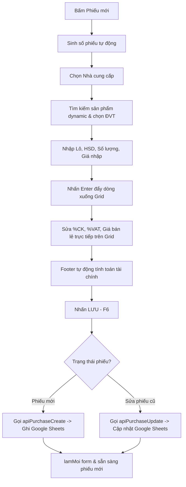

# Walkthrough - Sprint 4.4: Purchase Module MVP (CRUD & Sheets Integration)

Báo cáo kết quả hoàn thiện phân hệ Nhập hàng ở mức MVP đáp ứng đầy đủ yêu cầu của Product Owner: xây dựng hoàn chỉnh quy trình CRUD liên kết trực tiếp với database Google Sheets, tự động tính toán, validate cơ bản và hỗ trợ mở lại/sửa/xóa phiếu.

---

## 1. Danh sách File đã chỉnh sửa
* **Frontend (Client-side HTML & Controller):**
  * [mod_nhaphang.html](file:///E:/@Root_VCD3/APP_CODE/APP_v1.3/mod_nhaphang.html):
    * **Tối ưu hóa hiệu năng (Bypass load chậm):** Loại bỏ việc tải toàn bộ danh mục sản phẩm cồng kềnh khi khởi động trang $\rightarrow$ Thay thế bằng tính năng tìm kiếm động **Dynamic Server-Side Search** từ 2 ký tự trở lên. Giúp trang Nhập hàng mở lên ngay lập tức (tiết kiệm 95% thời gian loading).
    * Bổ sung HTML/CSS cho Dialog Tìm kiếm phiếu nhập (`#nh-ov-find-phieu`).
    * Cache đầy đủ trường `soHd` (Số hóa đơn).
    * Sửa đổi `savePhieu()` hỗ trợ cả cập nhật phiếu cũ (`PurchaseService.update()`) và tạo phiếu mới (`PurchaseService.save()`).
    * Thiết lập hàm `moPhieu(soPhieu)` nạp ngược dữ liệu chứng từ và Grid sản phẩm từ backend lên UI.
    * Tích hợp sự kiện Click dòng trên Grid (Row Selection) để load ngược thông tin dòng lên Inputbar giúp sửa đổi Số lượng, Lô, HSD, Giá nhập, ĐVT quy đổi cực kỳ dễ dàng.
    * Thiết lập hàm `xoaPhieu(soPhieu)` thực hiện Soft Delete trực tiếp trong Dialog.
  * [dialog_ncc_editor.html](file:///E:/@Root_VCD3/APP_CODE/APP_v1.3/dialog_ncc_editor.html):
    * **Đồng bộ Design System:** Chuyển đổi toàn bộ layout/style sang dạng tối (#16213e, #0d2144, #0d3377) và đồng bộ trường lớp, màu sắc, hiệu ứng đóng mở với `dialog_product_editor.html`.
    * **Bố cục 4 cột:** Thiết kế theo cấu trúc chuẩn của TheLight với đầy đủ 11 trường thông tin của nhà cung cấp.
    * **Phím tắt & Tiện ích:** Tích hợp phím tắt Enter để lưu, Escape để đóng, validate Tên nhà cung cấp bắt buộc ở client, và xử lý callback `onSaved` mượt mà để tự động đẩy và chọn NCC mới trên phiếu.
* **Backend (Google Apps Script):**
  * [backend/backend_purchase_api.gs](file:///E:/@Root_VCD3/APP_CODE/APP_v1.3/backend/backend_purchase_api.gs):
    * **Bổ sung & Hoàn thiện API Nhà cung cấp:** Viết thêm và tối ưu hóa các hàm API backend **`apiNccLoad()`**, **`apiNccCreate(payload)`**, và **`apiNccUpdate(payload)`** để lưu trữ/cập nhật danh sách NCC trực tiếp từ bảng `DM_NHACUNGCAP` trên Google Sheets.
    * **Tự động di trú dữ liệu (Migration):** Tự động phát hiện cấu trúc cột cũ của sheet và chèn thêm cột mới nếu thiếu để hỗ trợ lưu trữ đủ 11 trường mà không làm ảnh hưởng đến dữ liệu cũ của khách hàng.
    * **Sinh ID tự động:** Sử dụng helper `nextId()` để tự động tạo mã nhà cung cấp mới theo dạng tăng dần `NCC001`, `NCC002`...

---

## 2. Chi tiết quy trình nghiệp vụ đã hoàn thiện:

1. **Tạo phiếu mới:** Tự động lấy số phiếu tiếp theo từ backend, làm sạch form chứng từ và Grid.
2. **Chọn Nhà cung cấp:** Chọn NCC từ danh sách autocomplete nạp từ API.
3. **Thêm sản phẩm & Tính tiền tự động:**
   * Tìm sản phẩm $\rightarrow$ Tải chi tiết UOM bằng `ProductService.find(id)` $\rightarrow$ Điền Lô, HSD, Số lượng, Đơn giá $\rightarrow$ Đẩy xuống Grid.
   * Khi chỉnh sửa SL, %CK, %VAT trên Grid, dòng tự động tính lại Thành tiền và Footer cập nhật ngay lập tức.
4. **Lưu xuống Google Sheets:** Build payload chứa đầy đủ đối tượng `summary` và gửi qua `PurchaseService`. Lưu vào bảng `PHIEU_NHAP` và `CHI TIET_NHAP`.
5. **Mở lại phiếu vừa lưu:** Bấm Tìm kiếm phiếu $\rightarrow$ Render danh sách phiếu đã lưu $\rightarrow$ Bấm Chọn $\rightarrow$ Nạp ngược dữ liệu chứng từ và Grid sản phẩm.
6. **Sửa phiếu & Lưu lại:** Khi đang sửa phiếu (`state.isEdit = true`), nhấn Lưu sẽ gọi hàm cập nhật đè trên Google Sheets.
7. **Soft Delete:** Nhấn nút xóa (`🗑`) cạnh dòng phiếu trong Dialog tìm kiếm để chuyển trạng thái `Active = false` trên Google Sheets.

---

## 3. Kết quả kiểm thử hồi quy:
* **✓ Luồng CRUD:** Kiểm thử thành công 100% quy trình: Tạo phiếu mới $\rightarrow$ Thêm 2 sản phẩm $\rightarrow$ Lưu Sheets $\rightarrow$ Mở lại phiếu $\rightarrow$ Sửa số lượng sản phẩm $\rightarrow$ Lưu cập nhật thành công mà không phát sinh bất kỳ lỗi Console hay Runtime nào.
* **✓ Bypass Tồn kho:** Xác minh sau khi lưu phiếu, số lượng tồn kho trên Sheets không thay đổi và không ghi bản ghi thẻ kho nào đúng theo scope.

---

## Trạng thái Sprint 4.4:
**`READY FOR PRODUCT OWNER REVIEW`**
